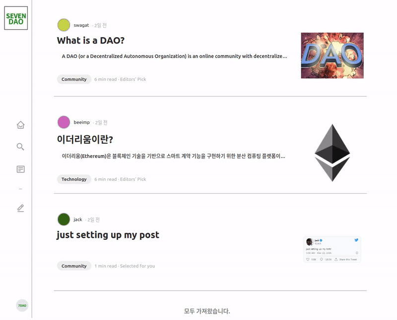
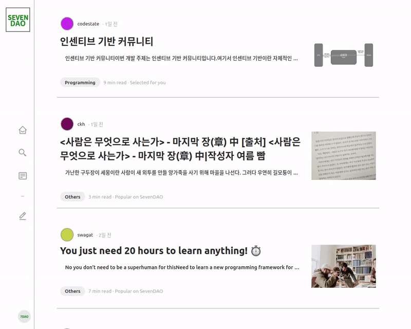
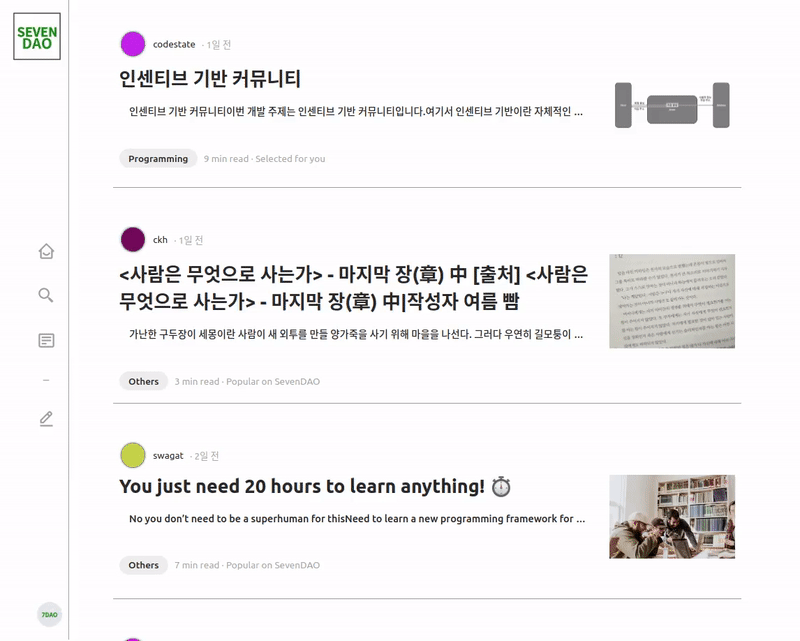
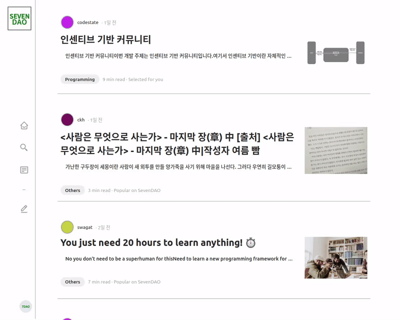
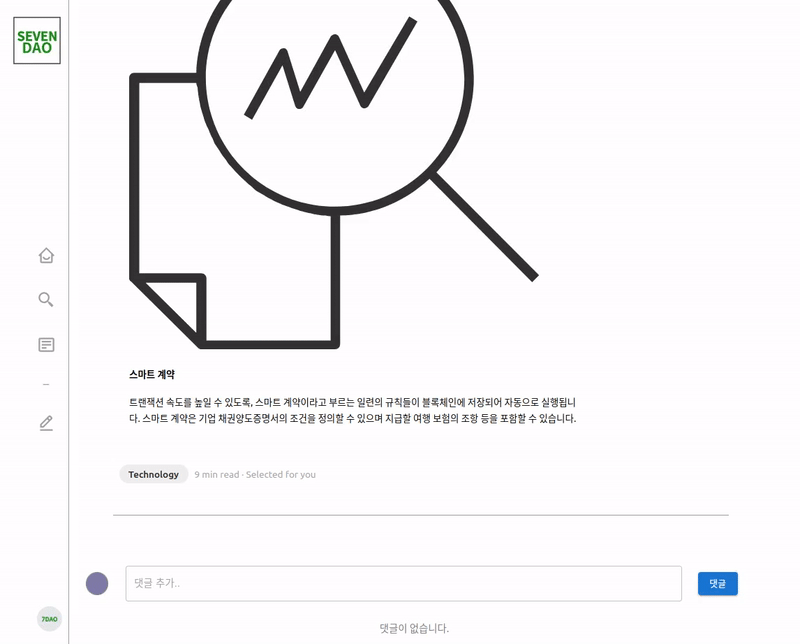
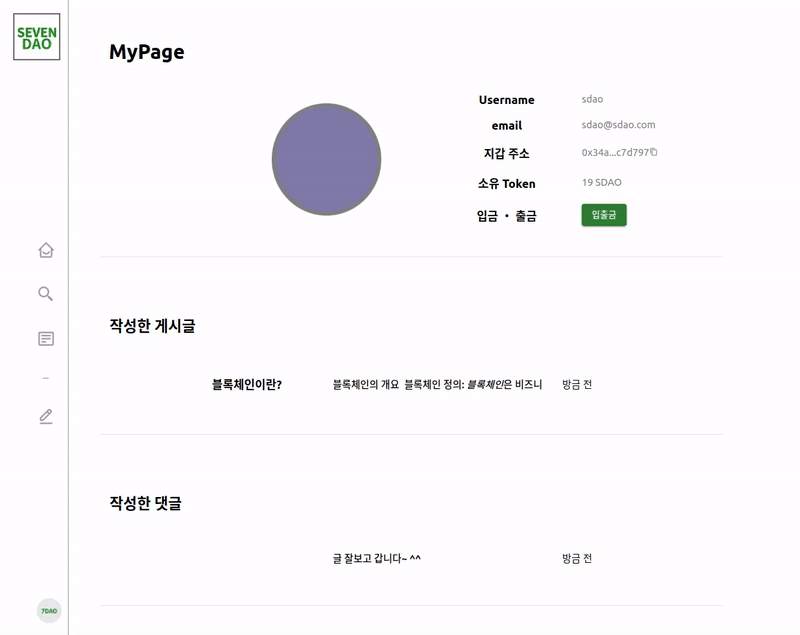

# [BEB04_PROJECT_2] SevenDAO Community

## 팀명 - SevenDAO

## 팀 구성 및 역할

### 팀원 구성

- Front-end - 2명
- Back-end & Blockchain - 2명

## 프로젝트 목표

- **인센티브 기반 커뮤니티를 구현**
- **인센티브 시스템의 동작 원리를 이해하고, 서버기반 지갑 서비스를 구현**
- Web2.0 기반 커뮤니티 사이트의 아키텍처를 이해
- ERC-20 스마트 컨트랙트 이해 및 새로운 형태의 함수 구현

## 프로젝트 기간

- 2022년 6월 20일 ~ 7월 1일
- 회의 - 오후 5시마다 회의 진행
  - 디스코드 또는 줌 소회의실

## 구현 내용 및 범위

### 기본 기능

- 게시글 작성 및 조회
- 댓글 작성 및 조회
- 로그인 및 회원가입
- 디비 연동

### 주요 기능

- SDAO 인센티브
- ERC20 입출금 및 선물하기
- ERC721 게시글 업로드 및 조회

### 추가 기능

- 회원가입 기능이 있는 클라이언트 개발
- Ropsten 네트워크에서 컨트랙트 배포하고 사용

### 도전과제

- ~~NFT기반 DEX~~
- ~~MultiSig~~
- ~~투표 시스템~~
- ~~Web3.0 Convert~~

### 구현범위

- **인센티브 기반 커뮤니티**

  - 니모닉 월렛 개발
  - Express를 사용한 라우팅 분기
  - DB 연동
- **커뮤니티 토큰 발행** - 로그인을 하거나 글을 작성할 때, 댓글을 작성 보상

  - 서버용 account 생성
    - 가스비를 위해 만든 account에 코인(1ETH) 전송
  - 로컬 테스트넷 또는 테스트넷에 컨트랙트 배포 및 연동
  - 로그인, 글 또는 댓글 작성 시 ERC-20 토큰 보상에 대한 트랜잭션 전송
- **스마트 컨트랙트와 연결된 트랜잭션을 모니터링**

  - ganache 실행 & ERC20 스마트 컨트랙트 배포
  - Web3를 localhost에 연결 & 블록 조회
    - getBlockNumber 등 블록조회 메소드를 이용해 블록 데이터 요청getTransaction 과 같이 트랜잭션 조회 메소드를 이용해 블록 데이터 내의 트랜잭션 데이터 요청
    - Database 연결 & 테이블 생성
  - 트랜잭션 데이터를 데이터베이스에 기록
  - crontab, pm2 등을 이용해 데몬을 주기적으로 실행
  - Advanced
    - 최근에 조회한 블록 이후부터 최신 블록까지의 범위만 데이터를 요청
    - 관련이 있는 트랜잭션만 데이터베이스에 기록
- ****ERC-20 토큰으로 ERC-721 구매하기****

  - ERC20 민팅에 approve 추가하기
- MultiMintToken - 오프체인 솔루션 도입MultiMintToken - 오프체인 솔루션 도입

## 기술스택

### Blockchain

- **Languege** - Solidity
- **Core** - Ethereum
- **Network** - Ropsten testnet, Ganache testnet
- **Tools** - Remix IDE

### Back-end

- **Languege** - JavaScript
- **Core** - Express.js
- **DB** - MongoDB

### Front-end

- **Languege** - TypeScript
- **Core** - Next.js, React.js
- **상태관리** - Redux
- **Style** - SCSS, Emotion, mui
- **API** - Axios
- **협업관련 -** eslint, prettier

## 시나리오

### 게시글 조회

1. 사용자는 메인페이지에 접속한다.
2. 클라이언트는 서버에 게시글 정보를 요청한다.
3. 서버는 DB에 저장된 게시글 n개를 응답한다.

### 상세글 조회

1. 사용자는 게시글 중 한개를 클릭한다.
2. 클라이언트는 사용자가 클릭한 게시글 id를 통해 서버에 게시글 상세 정보를 요청한다.
3. 서버는 게시글 id를 통해 DB에서 게시글을 조회하여 응답한다.
4. 클라이언트는 응답한 게시글 정보를 사용자에게 보여준다.

### 회원가입

1. 사용자는 회원가입 버튼을 클릭한다.
2. 사용자는 폼을 작성하여 회원가입 버튼을 클릭한다.
3. 클라이언트는 회원 정보를 서버에 인증 요청한다.
4. 서버는 회원정보와 사용자 지갑을 생성하여 DB에 저장한다.
5. 서버는 JWT로 클라이언트에 응답한다.
6. 클라이언트는 쿠키에 JWT를 저장하고 로그인에 성공하여 메인 페이지를 표시한다.

### 로그인

1. 사용자는 로그인 버튼을 클릭한다.
2. 사용자는 아이디/패스워드를 입력하여 로그인하기 버튼을 클릭한다.
3. 클라이언트는 아이디/패스워드에 대한 유효성 검사 후 사용자 계정 정보를 서버에게 인증 요청을 보낸다.
4. 서버는 아이디/패스워드에 대한 유효성 검사 후 성공 시 JWT를 생성하여 응답한다.
5. 클라이언트는 JWT를 쿠기에 저장하고 메인 페이지로 이동한다.

### 게시글 작성

1. 사용자는 게시글 작성 페이지를 클릭한다.
2. 사용자는 게시글 폼에 맞춰 게시글을 작성하여 완료 버튼을 클릭한다.
3. 클라이언트는 작성된 게시글 폼을 서버에 게시글 POST 요청한다.
4. 서버는 게시글 폼을 DB에 저장하고 성공 또는 실패 메세지를 응답한다.

### 댓글 작성

1. 사용자는 해당 게시글 상세페이지에서 댓글을 작성한다.
2. 클라이언트는 작성한 댓글의 게시글 Id와 댓글 정보를 서버에 댓글 POST 요청한다.
3. 서버는 댓글을 DB에 저장하고 성공 또는 실패 메세지를 응답한다.

### 마이페이지 ( 토큰 입출금 및 선물하기 )

1. 사용자는 로그인 후 마이페이지로 이동 가능하다.
2. 마이페이지는 사용자명, 이메일, 지갑주소, 보유 토큰 수량을 확인할 수 있다.
3. 마이페이지는 입출금 기능이 포함되어 있으며, 버튼을 클릭하면 입출금 창이 표시된다.
4. 입출금 창에서 입금 부분에서는 사용자의 입금 주소 및 QR코드를 제공한다.
5. 입출금 창에서 출금 부분에서는 출금하기와 선물하기 기능을 제공한다.

## 프로젝트 진행 중 발생한 이슈

### 1일차 - 2022.6.20.

- 지갑 생성 위치
- 회원가입 시 2가지 → 3가지
  - username
  - email
  - password

### 2일차 - 2022.6.21.

- NEXT api로 서버 개발 후 Vercel 배포 문제
- DB 위치 - 로컬, 아틀라스

### 3일차 - 2022.6.22.

- cors 오류
- JS → TS 변환 어려움

### 4일차 - 2022.6.23.

- 텍스트 편집기 선택에 어려움
  - development 모드 오류 수정 못함
- getStaticProps 오류
- web3 이더 단위 오류
  - web3.utils
- 실제 이더 기반일 경우 가스비가 많이 소모되니까
- 디비 초기화
  - 최대용량 1기가
  - 방안 - 추후 어느정도 완성되면 초기화 진행
- 게시글, 댓글 작성시 체인에 올리기
- 게시글에 대한 댓글 조회

### 5일차 - 2022.6.24.

- 토큰 배분 유틸화
- 서버에 저장되어 있는 개인 지갑에 가스비 지출 어려움
  - 가스비를 낼 이더가 없다.
  - 유저가 개인 지갑으로 출금 요청할때 서버의 유저 개인 지갑에 이더가 없기 때문
  - 업로드 → 체인 → 디비
- 게시글을 체인에 올리기
  - 글 JSON → IPFS → ERC721로 올리기
- Owner 파산 문제
  - 출금시 수수료 지불로 해결

### 6일차 - 2022.6.27.

- 컨트랙트에 Post할 때, 토큰 받는 것까지 저장할 때 20초 정도 소요됨
  - 토큰 → 거래소처럼
  - 게시글 → 모두 체인(IPFS 등)

### 7일차 - 2022.6.28

- 입출금시 수수료 문제
  - 서버 DB에 저장된 토큰 개수 + 체인에 저장된 토큰
    - 외부 사용자 - 10개씩 소모
    - 내부 사용자 - 5개씩 소모
  - 회원가입 10개
  - 로그인 5개
  - 글쓰기 3개
  - 댓글 1개
- JWT 만료 후 자동 로그아웃
- 파일사이즈 문제
  - IPFS에 최대 용량
- 출금하기에서 멀티 민트

### 8일차 - 2022.6.29.

- 토큰 출금 이슈
  - 가스비
- 토큰 입력 이슈
  - 무조건 문자열로 처리하기
- 깃 병합 이슈

### 9일차 - 2022.6.30.

- 오류 발생시 롤백 안됨
- 서버 DB에서 토큰 전체 발행 개수 확인하지 않음
- 무한 스크롤 구현
- Next/image url 이슈
- Client와 Server 병합 문제
